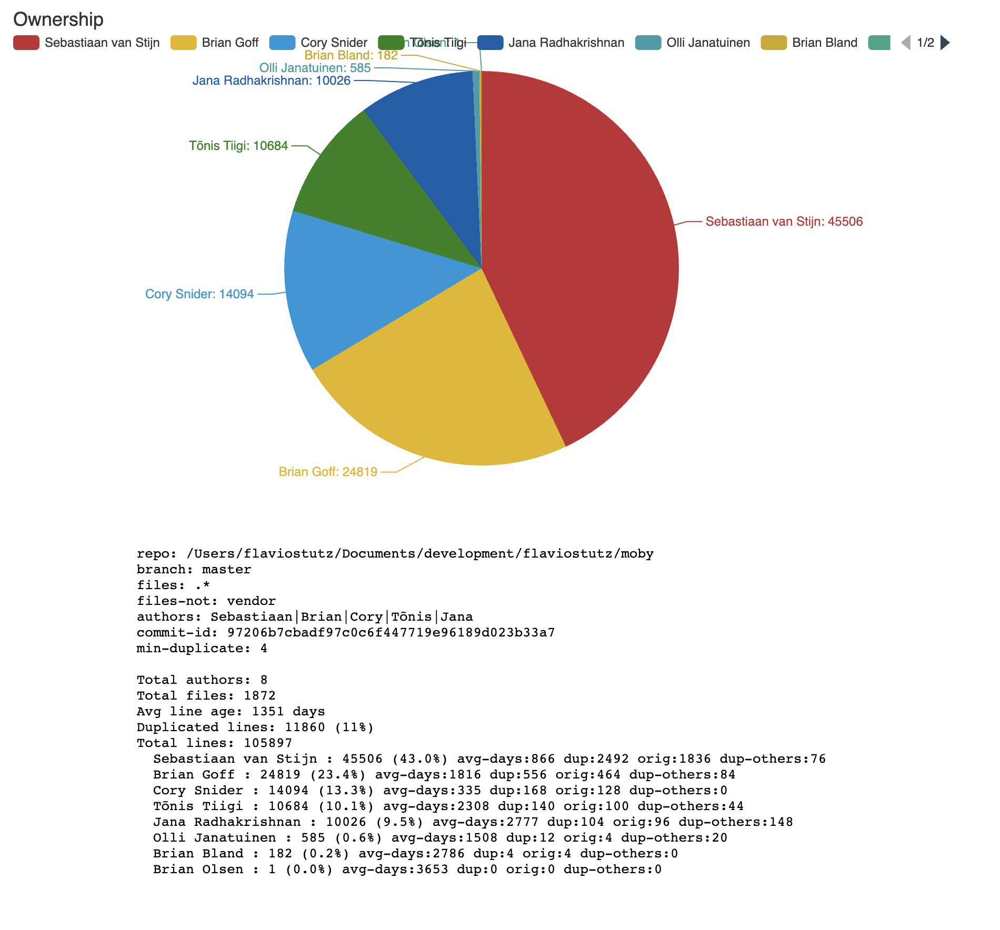
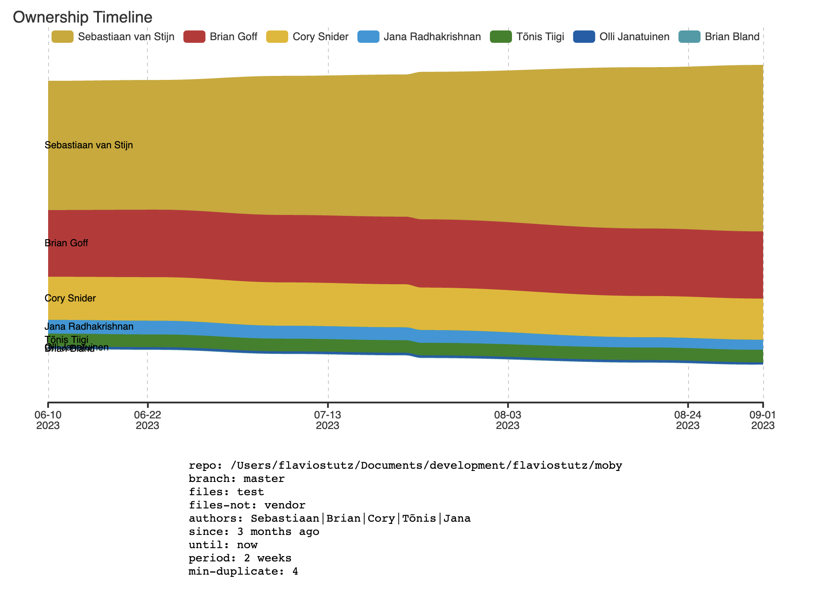
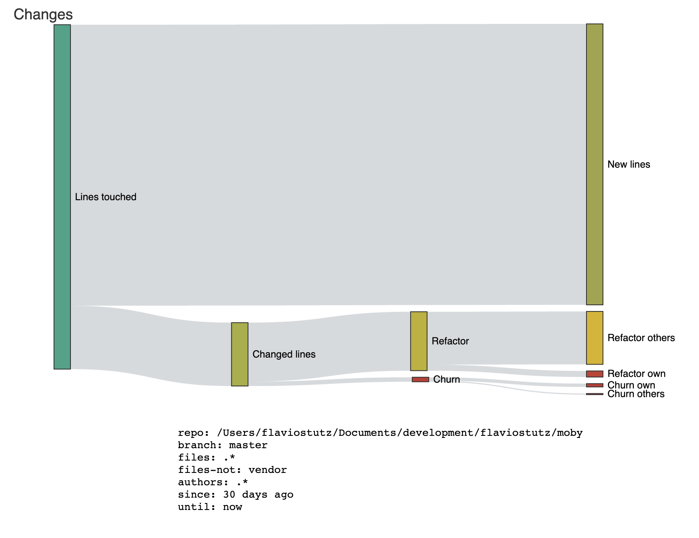

# gitwho

Shows statistics about changed lines and line ownership per authors in a git repo. Take a look at the team or individual devs to understand better their behaviour and their evolution over time.

This utility gives you stats like:
  - Changed lines per author over time classified in new, churn, helper or refactor (see concepts below)
  - Files with most new, churn, helper or refactor changes
  - Total owned lines of code per author in a moment in time
  - Info about duplicated lines with file and line number indication
  - You can always filter parts of the repo (file name regexes), branches or to a certain point in time in git history

## Usage

* We are distributing gitwho via npx/npx for now
* Use `npx -y @gitwho/darwin-arm64@latest` for Mac M1
* Use `npx -y @gitwho/darwin-amd64@latest` for older Macs
* other options: @gitwho/linux-arm64, @gitwho/linux-amd64, @gitwho/windows-amd64

```sh
npx -y @gitwho/darwin-arm64@latest ownership --help
npx -y @gitwho/darwin-arm64@latest changes --help
npx -y @gitwho/darwin-arm64@latest duplicates --help
```

### Example: show code ownership stats as of today
```sh
npx -y @gitwho/darwin-arm64@latest ownership

Total authors: 2
Total files: 50
Avg line age: 14 days
Duplicated lines: 199 (5%)
Total lines: 3668
  Flávio Stutz <flaviostutz@gmail.com>: 2718 (74.1%) avg-days:13 dup:157 orig:150 dup-others:8
  Flavio Stutz <flaviostutz@test.nl>: 950 (25.9%) avg-days:18 dup:42 orig:34 dup-others:7
```

* When using "--format graph"



### Example: show code ownership timeline stats
```sh
npx -y @gitwho/darwin-arm64@latest ownership-timeline

Date        Lines        Duplicates     Files       
2023-06-10  6864         33368          656         
2023-06-23  6864 (0)     33576 (+208)   658 (+2)    
2023-07-07  6784 (-80)   34599 (+1023)  668 (+10)   
2023-07-22  6780 (-4)    34945 (+346)   671 (+3)    
2023-07-23  6832 (+52)   35603 (+658)   672 (+1)    
2023-08-19  6820 (-12)   36758 (+1155)  674 (+2)    
2023-09-01  6868 (+48)   37327 (+569)   677 (+3)    
Inc/period  4 (+0%)      3959 (+11%)    21 (+3%)  

Sebastiaan van Stijn
Date        Lines          Duplicates (total)  Duplicates (original)  
2023-06-10  16076          1120                1028                   
2023-06-23  16135 (+59)    1132 (+12)          1044 (+16)             
2023-07-07  17304 (+1169)  1148 (+16)          1060 (+16)             
2023-07-22  17689 (+385)   1152 (+4)           1068 (+8)              
2023-07-23  18345 (+656)   1212 (+60)          1128 (+60)             
2023-08-19  20068 (+1723)  1260 (+48)          1168 (+40)             
2023-09-01  20715 (+647)   1320 (+60)          1220 (+52)             
Inc/period  4639 (+28%)    200 (+17%)          192 (+18%)
```

* When using "--format graph"




### Example: Show changes stats for the last 30 days

```sh
cd myrepo
npx -y @gitwho/darwin-arm64@latest changes

Total authors active: 2
Total files touched: 69
Average line age when changed: 7 days
- Total lines touched: 8739
  - New lines: 6650 (76%)
  - Changed lines: 2089 (23%)
    - Refactor: 252 (12%)
      - Refactor of own lines: 37 (14%)
      - Refactor of other's lines: 215 (85%)
      * Refactor done by others to own lines (help received): 215
    - Churn: 1837 (87%)
      - Churn of own lines: 1067 (58%)
      - Churn of other's lines (help given): 770 (41%)
      * Churn done by others to own lines (help received): 770

Author: Flávio Stutz <flaviostutz@gmail.com>
- Total lines touched: 6182 (70%)
  - New lines: 4790 (77%)
  - Changed lines: 1392 (22%)
    - Refactor: 206 (14%)
      - Refactor of own lines: 31 (15%)
      - Refactor of other's lines: 175 (84%)
      * Refactor done by others to own lines (help received): 40
    - Churn: 1186 (85%)
      - Churn of own lines: 870 (73%)
      - Churn of other's lines (help given): 316 (26%)
      * Churn done by others to own lines (help received): 454
  - Top files:
    - changes/analyser_worker.go (991)
    - changes/analyser.go (610)
    - utils/git_utils.go (395)
    - Makefile (360)
    - utils/duplicates.go (299)
```

* When using "--format graph"



### Example: Show duplicate lines

```sh
npx -y @gitwho/darwin-arm64@latest duplicates

Duplicated lines: 199 (5%)
ownership/analyser_test.go:18 - 22
  ownership/formatter_test.go:45 - 49
  ownership/formatter_test.go:28 - 32
  ownership/formatter_test.go:11 - 15
  ownership/analyser_test.go:46 - 49
  ownership/analyser_test.go:127 - 129
  ownership/analyser_test.go:106 - 108
  ownership/analyser_test.go:80 - 82
  changes/formatter_test.go:30 - 31
  changes/formatter_test.go:14 - 15
ownership/analyser_test.go:104 - 108
  ownership/analyser_test.go:125 - 129
  ownership/analyser_test.go:46 - 48
  ownership/analyser_test.go:19 - 21
  ownership/formatter_test.go:46 - 48
  ownership/formatter_test.go:29 - 31
  ownership/formatter_test.go:12 - 14
  ownership/analyser_test.go:80 - 81
```

### gitwho ownership

* Gets the current situation of a repository in a moment in time and counts how many lines of code was created by whom by doing git blame in all files in the repo. For more info, check https://git-scm.com/docs/git-blame


## Commands

### gitwho ownership

* Shows the current situation of the ownership of lines of code in repository per author. The author that last changed a certain line is considered the "owner" of the line of code.

```sh
gitwho ownership --help
Usage of ownership:
  -branch string
        Branch name to analyse (default "main")
  -files string
        Regex for selecting which file paths to include in analysis (default ".*")
  -files-not string
        Regex for filtering out files from analysis
  -format string
        Output format. 'full' (duplicated lines and line age details) or 'short' (lines per author) (default "full")
  -profile-file string
        Profile file to dump golang runtime data to
  -repo string
        Repository path to analyse (default ".")
  -verbose
        Show verbose logs during processing (default true)
  -when string
        Date time to analyse (default "now")
```

### gitwho changes

* Go through all the commits in a certain period and classify which kind of change was done to the lines changed. The final result is the sum of all changes, so for example, if the same line was touched in 4 commits, it will show as 4 lines changed in total. The idea is to show the running effort during coding.

```sh
gitwho changes --help
Usage of changes:
  -branch string
        Regex for filtering changes by branch name (default "main")
  -files string
        Regex for filtering which files paths to analyse (default ".*")
  -files-not string
        Regex for filtering out files from analysis
  -format string
        Output format. 'full' (all authors with details) or 'short' (top authors by change type) (default "full")
  -profile-file string
        Profile file to dump golang runtime data to
  -repo string
        Repository path to analyse (default ".")
  -since string
        Filter changes made from this date (default "30 days ago")
  -until string
        Filter changes made util this date (default "now")
  -verbose
        Show verbose logs during processing (default true)
```

#### Types of change concept

When a line is added or deleted by a commit, the context of the change will be analysed so we can classify it in:

- *Code churn*
  - Lines that were changed by the same dev multiple times in a very short period
  - Might indicate code that is unstable, buggy or that gets pushed to repo too soon, before minimum quality

- *Code help*
  - Lines that were changed by a different dev multiple times in a very short period (<= 21 days)
  - Might indicate someone helping other devs to strive/meeting their goals by removing bugs, enhancing code from newly created features etc

- *Code refactor*
  - Lines that were changed after a while (> 21 days)
  - Might indicate code that was improved because of tech debt resolutions, continuous improvement behaviours or hard to tackle bugs found after the code was being used for a while

- *New Code*
  - New lines of code
  - Might indicate new features being added or spikes being made

See more info in this excelent article: https://www.hatica.io/blog/code-churn-rate/

### gitwho duplicates

* Shows duplicate lines found among all the files in the repo. You can tweak the search to only consider a certain line as "duplicate" if more than one line is in a group of duplications (defaults to 4 lines)

```sh
gitwho duplicates --help
Usage of ownership:
  -branch string
        Branch name to analyse (default "main")
  -files string
        Regex for selecting which file paths to include in analysis (default ".*")
  -files-not string
        Regex for filtering out files from analysis
  -format string
        Output format. 'full' (show all file refs found) or 'short' (show a limited number of file refs) (default "full")
  -profile-file string
        Profile file to dump golang runtime data to
  -repo string
        Repository path to analyse (default ".")
  -verbose
        Show verbose logs during processing (default true)
  -when string
        Date time to analyse (default "now")
```

## More examples

* Show simple list of authors with most lines of code in markdown pages
  * `gitwho ownership --branch main --files .md --format short`

* Show ownership details of Golang source codes, excluding anything with "vendor" in its path as it was 1 year ago
  * `gitwho ownership --branch master --files ".go$" --files-not "vendor" --when "1 year ago" --format full`

* Show the top authors that made changes to .ts files from 5 years ago to 3 years ago (during 2 years). It will display top coders, the ones with most new codes, most refactors and most churn
  * `gitwho changes --branch main --files .ts --since "5 years ago" --until "3 years ago" --format short`

* Show list of files along with other files that have duplicate contents between them for Go files. Only consider a duplicate if there is more than 4 lines in a row that is similar between files.
  * `gitwho duplicates --branch main --files .go --format short --min-dup-lines 4`

## Analysis details

- Blank lines and a few common source code keywords, such as "import", "export", "package" etc are excluded from duplication analysis

- For detecting line ownership, line age etc gitwho uses "git blame"

